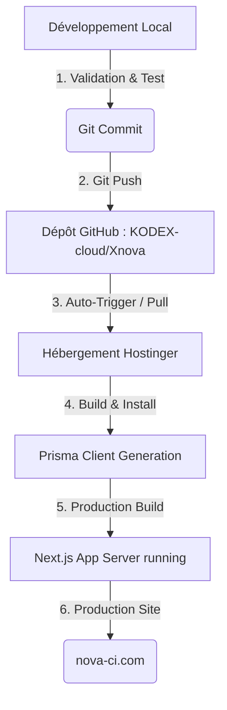

# Guide de Déploiement Professionnel — NOVA

Ce document décrit les procédures standards pour le déploiement, la gestion, la sauvegarde et la restauration de la plateforme **NOVA Marketplace** (Next.js 15 + Prisma + PostgreSQL/Supabase) en utilisant un workflow robuste s'appuyant sur **GitHub** et **Hostinger**.

---

## 1. Architecture du Workflow CI/CD

Le déploiement de NOVA repose sur un pipeline moderne où GitHub sert de source unique de vérité. Toute modification de code doit être validée localement, commise, poussée sur GitHub, puis déployée automatiquement ou manuellement sur l'hébergement Hostinger.



---

## 2. Étape 1 : Audit et Sécurité du Dépôt Git

### 2.1 Fichiers Ignorés (Sécurité Absolue)
Pour éviter les fuites d'informations sensibles (clés d'API, bases de données locales, variables de session), le fichier `.gitignore` a été audité et configuré de manière stricte.

Les éléments suivants **ne doivent jamais** être poussés sur GitHub :
*   `.env` et tous les fichiers `.env*.local` (Contiennent les mots de passe de production et les clés NextAuth)
*   `node_modules/` (Dépendances Node installées à la volée sur le serveur)
*   `.next/` et `out/` (Fichiers de build générés localement)
*   `prisma/*.db` et `prisma/*.db-journal` (Bases de données SQLite locales de développement)
*   `public/uploads/` (Images et médias envoyés par les utilisateurs lors de l'utilisation du site)
*   `.vercel/` et dossiers temporaires d'éditeurs (`.idea/`, `.vscode/`, `.DS_Store`)

> [!WARNING]
> Si une clé API ou un fichier `.env` est poussé par erreur sur GitHub, la clé doit être immédiatement révoquée et recréée, et le fichier supprimé de l'historique Git en utilisant `git filter-repo` ou `bfg-repo-cleaner`.

---

## 3. Étape 2 : Workflow Quotidien de Développement

Pour assurer la stabilité et éviter tout conflit de code, appliquez rigoureusement ce workflow à chaque modification :

```bash
# 1. Vérifier le statut local et s'assurer que la branche est 'main'
git status

# 2. Récupérer les dernières mises à jour du dépôt distant
git pull origin main

# 3. Effectuer vos modifications de code localement

# 4. Ajouter les fichiers modifiés à l'index Git
git add .

# 5. Créer un commit explicite décrivant vos changements
git commit -m "feat/style: description claire des modifications"

# 6. Envoyer les modifications sur GitHub
git push origin main
```

---

## 4. Étape 3 : Déploiement sur Hostinger

Selon votre abonnement Hostinger (Hébergement Web Mutualisé / Cloud vs. VPS Dédié), choisissez l'une des deux méthodes professionnelles ci-dessous.

---

### METHODE A : Hébergement Hostinger Node.js (hPanel Cloud/Business)

Si votre formule Hostinger inclut l'option **Application Web Node.js** dans le hPanel :

#### 1. Configuration Initiale dans hPanel
1. Connectez-vous à votre **hPanel Hostinger**.
2. Allez dans **Sites web** > **Ajouter un site web** ou sélectionnez **nova-ci.com**.
3. Choisissez **Application Web Node.js** (ou allez dans l'onglet **Avancé** > **Node.js**).
4. Cliquez sur **Créer une application**.

#### 2. Connexion Git / GitHub
1. Sélectionnez **Importer un dépôt Git**.
2. Connectez et autorisez votre compte GitHub possédant l'accès à `KODEX-cloud/Xnova`.
3. Sélectionnez le dépôt `KODEX-cloud/Xnova` et la branche `main`.
4. Le hPanel configurera automatiquement un webhook de déploiement automatique : **chaque `git push` sur la branche `main` déclenchera un nouveau build**.

#### 3. Configuration des Variables d'Environnement
Dans la section de configuration de l'application Node.js sur Hostinger, vous devez renseigner manuellement toutes les clés qui se trouvent dans votre `.env.local` pour la production. 

Ajoutez les variables suivantes :
*   `DATABASE_URL` : L'URL de connexion de votre base de données PostgreSQL de production (ex: Supabase).
*   `NEXTAUTH_URL` : `https://nova-ci.com`
*   `NEXTAUTH_SECRET` : Votre clé secrète générée pour chiffrer les sessions JWT.
*   `NEXT_PUBLIC_CLOUDINARY_CLOUD_NAME` : (Si applicable) Clé Cloudinary.
*   `CLOUDINARY_API_KEY` & `CLOUDINARY_API_SECRET` : (Si applicable) Clés API.

#### 4. Build et Lancement
Configurez les commandes de cycle de vie dans Hostinger :
*   **Version de Node** : Choisissez `20.x` ou `18.x`.
*   **Commande d'installation** : `npm install`
*   **Commande de build** : `npm run build` (Exécute `prisma generate && next build` automatiquement).
*   **Point d'entrée / Commande de démarrage** : `npm run start` (Exécute `next start`).

Cliquez sur **Déployer**. L'application installe ses dépendances, compile le code Next.js et démarre le serveur.

---

### METHODE B : Serveur VPS Hostinger avec PM2 (Recommandé pour la Production)

Le déploiement sur un **VPS Hostinger** (Ubuntu Server) offre un contrôle total de la mémoire, de la stabilité et des performances de Next.js 15.

#### 1. Configuration Initiale du VPS
Connectez-vous à votre VPS Hostinger en SSH :
```bash
ssh root@<IP_VOTRE_VPS>
```

Installez Node.js, Git, PM2 et Nginx :
```bash
# Mettre à jour le système
sudo apt update && sudo apt upgrade -y

# Installez Node.js (via NodeSource LTS)
curl -fsSL https://deb.nodesource.com/setup_20.x | sudo -E bash -
sudo apt-get install -y nodejs

# Installer PM2 globalement
sudo npm install pm2 -g

# Installer Nginx
sudo apt install nginx -y
```

#### 2. Cloner le Projet & Configurer les Variables
Accédez au dossier de déploiement :
```bash
cd /var/www
git clone https://github.com/KODEX-cloud/Xnova.git nova
cd nova
```

Créez le fichier `.env.local` avec les configurations réelles de production :
```bash
nano .env.local
```
*(Collez vos variables d'environnement de production, puis sauvegardez avec `Ctrl+O` et quittez avec `Ctrl+X`)*.

#### 3. Installer les Dépendances, Générer Prisma & Builder
```bash
# Installer les dépendances de production
npm install

# Générer le client Prisma pour PostgreSQL
npx prisma generate

# Compiler l'application Next.js
npm run build
```

#### 4. Lancer avec PM2 (Process Manager)
PM2 assure que l'application Next.js reste active en arrière-plan et redémarre automatiquement en cas de crash du serveur.
```bash
# Démarrer Next.js avec PM2
pm2 start npm --name "nova-app" -- start

# Configurer le démarrage automatique de PM2 au boot du VPS
pm2 startup systemd
pm2 save
```

#### 5. Configuration de Nginx en Reverse Proxy
Configurez Nginx pour rediriger le trafic du port 80/443 vers le port local de l'application Next.js (port 3000 par défaut).
```bash
sudo nano /etc/nginx/sites-available/nova
```

Collez la configuration suivante :
```nginx
server {
    listen 80;
    server_name nova-ci.com www.nova-ci.com;

    location / {
        proxy_pass http://localhost:3000;
        proxy_http_version 1.1;
        proxy_set_header Upgrade $http_upgrade;
        proxy_set_header Connection 'upgrade';
        proxy_set_header Host $host;
        proxy_cache_bypass $http_upgrade;
    }
}
```

Activez le site et redémarrez Nginx :
```bash
sudo ln -s /etc/nginx/sites-available/nova /etc/nginx/sites-enabled/
sudo nginx -t
sudo systemctl restart nginx
```

> [!TIP]
> Installez Let's Encrypt pour sécuriser gratuitement votre site en HTTPS :
> ```bash
> sudo apt install certbot python3-certbot-nginx -y
> sudo certbot --nginx -d nova-ci.com -d www.nova-ci.com
> ```

#### 6. CI/CD Automatique avec GitHub Actions
Pour déployer à chaque `git push` sur GitHub, créez le fichier `.github/workflows/deploy.yml` localement :
```yaml
name: Deploy to Hostinger VPS

on:
  push:
    branches:
      - main

jobs:
  deploy:
    runs-on: ubuntu-latest
    steps:
      - name: Deploy via SSH
        uses: appleboy/ssh-action@master
        with:
          host: ${{ secrets.VPS_HOST }}
          username: ${{ secrets.VPS_USER }}
          key: ${{ secrets.VPS_SSH_KEY }}
          script: |
            cd /var/www/nova
            git pull origin main
            npm install
            npx prisma generate
            npm run build
            pm2 restart nova-app
```

---

## 5. Procédures de Sauvegarde (Backup)

La sauvegarde de NOVA comporte deux parties : la Base de Données (Supabase/PostgreSQL) et les Fichiers Médias locaux.

### 5.1 Sauvegarde de la Base de Données PostgreSQL
Si vous utilisez Supabase (recommandé), les sauvegardes quotidiennes sont automatiques. Pour effectuer une sauvegarde manuelle à tout moment :

```bash
# Exporter la structure et les données depuis votre machine locale ou VPS
pg_dump -h db.yoursupabasehost.supabase.co -U postgres -d postgres > backup_nova_$(date +%F).sql
```

### 5.2 Sauvegarde des Fichiers Uploadés (Images)
Si les images des annonces sont stockées localement dans `public/uploads/` :

```bash
# Sur le VPS, compresser le répertoire public/uploads dans un dossier sécurisé
tar -czvf /var/backups/nova-uploads-$(date +%F).tar.gz /var/www/nova/public/uploads
```

---

## 6. Procédures de Retour Arrière (Rollback)

En cas d'erreur critique après un déploiement, vous devez restaurer immédiatement la dernière version stable de l'application.

### 6.1 Rollback du Code (Git)
1. Identifiez le hash du dernier commit stable dans l'historique :
   ```bash
   git log --oneline
   ```
2. Forcez la branche locale/distante sur ce commit stable (ex: commit `e1ce79c`) :
   ```bash
   # Sur le serveur de production / VPS
   git reset --hard e1ce79c
   
   # Regénérer et recompiler le code stable
   npx prisma generate
   npm run build
   
   # Redémarrer l'application
   pm2 restart nova-app
   ```

### 6.2 Restauration de la Base de Données
Si une migration de base de données a corrompu vos données, importez le dernier fichier sql sauvegardé :

```bash
psql -h db.yoursupabasehost.supabase.co -U postgres -d postgres -f backup_nova_YYYY-MM-DD.sql
```

---

## 7. Vérifications de Routine Après Déploiement

Après tout déploiement ou retour arrière, effectuez ces tests rapides :
1. **Accès Public** : Ouvrez `https://nova-ci.com` et naviguez sur les pages (Accueil, Automobile, Immobilier, Blog).
2. **Statut API & DB** : Connectez-vous au dashboard utilisateur ou admin pour vérifier les sessions NextAuth et la bonne récupération des données en base.
3. **Upload d'Image** : Créez une annonce de test avec une image et validez l'intégration dans la bibliothèque de médias.
4. **Vérification des Logs** :
   *   Sur le VPS : `pm2 logs nova-app`
   *   Dans Nginx : `tail -f /var/log/nginx/error.log`

---

## 8. Déploiement de la Version PHP Native (CMS-First) sur Hostinger

La version PHP Native de NOVA a été conçue pour être déployée sur n'importe quelle formule d'hébergement Hostinger (Mutualisé, Cloud, ou VPS) avec PHP 8.3 et MySQL.

### 8.1 Préparation de la Base de Données
1. Connectez-vous à votre **hPanel Hostinger**.
2. Allez dans **Bases de données** > **Gestion des bases de données MySQL**.
3. Créez une nouvelle base de données et notez les informations :
   * Nom de la base de données
   * Identifiant de l'utilisateur
   * Mot de passe
4. Cliquez sur **Entrer dans phpMyAdmin**.
5. Importez le schéma de table en chargeant le fichier [schema.sql](file:///c:/Users/PC/AppData/Local/Packages/Claude_pzs8sxrjxfjjc/LocalCache/Roaming/Claude/Nova/php/database/schema.sql).
6. Importez le jeu de données initial en chargeant le fichier [seed.sql](file:///c:/Users/PC/AppData/Local/Packages/Claude_pzs8sxrjxfjjc/LocalCache/Roaming/Claude/Nova/php/database/seed.sql).

### 8.2 Déploiement des Fichiers
1. Dans le **Gestionnaire de fichiers** de Hostinger (ou par FTP), accédez au répertoire de votre site (généralement `public_html`).
2. Copiez l'ensemble du contenu du sous-répertoire `/php/` de votre dépôt Git directement dans le dossier racine de votre nom de domaine sur Hostinger.
3. Assurez-vous que le dossier `public` de PHP est défini comme le dossier racine web (Document Root), ou utilisez le fichier `.htaccess` fourni pour rediriger le trafic transparent.

### 8.3 Configuration du Site
Ouvrez le fichier `config/config.php` sur le serveur et renseignez les identifiants de la base de données de production :
```php
define('DB_HOST', 'localhost'); // Ou l'hôte MySQL Hostinger
define('DB_USER', 'u123456789_nova');
define('DB_PASS', 'VotreMotDePasseBaseDeDonnees');
define('DB_NAME', 'u123456789_novadb');
```

L'application PHP Native est immédiatement fonctionnelle. Pour accéder à l'administration, rendez-vous sur `https://votre-domaine.com/auth/login` (Identifiants par défaut : `admin@nova.ci` / `admin123`).
